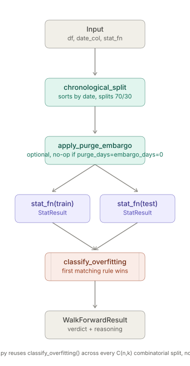
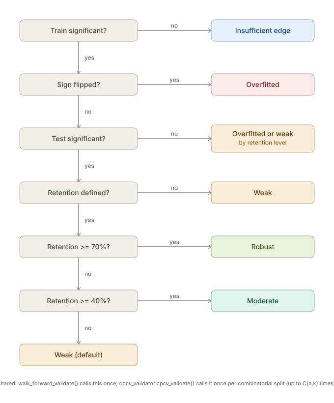

# signal-robustness-toolkit

Four small, independent, fully-tested Python modules for one recurring problem in
quantitative signal research: **a backtest result that looks statistically
significant on the whole sample is not the same as a result that's real.**


## What's here

| Module | Answers |
|---|---|
| `walk_forward_validator.py` | Split a backtest chronologically (train/test), recompute the same stat on both halves, and classify the result — `ROBUST` / `MODERATE` / `WEAK` / `OVERFITTED` / `INSUFFICIENT_INSAMPLE_EDGE`. A signal that only "worked" in-sample and evaporates or reverses out-of-sample gets caught here, not published as a finding. |
| `fama_macbeth.py` | For "many entities, few time periods" panels (e.g. ~300 stocks reporting on the same annual cycle, giving ~10-17 true independent cohorts, not thousands of independent stock-events) — pooled OLS understates the real clustering and inflates t-stats 4-5x. Runs one regression per cohort and tests the resulting time series of per-cohort estimates instead. |
| `multiple_comparison_correction.py` | Bonferroni, Holm (step-down, strictly more powerful than plain Bonferroni), and Benjamini-Hochberg FDR — for when you've tested more than one hypothesis and need to know which survivors are real. |
| `dedup_store.py` | Append-and-dedupe for an incrementally-growing CSV store, keyed on a natural key rather than row position. Closes a real, confirmed dtype-mismatch bug: an integer-looking key (like an exchange's own sequence ID) silently round-trips as `int64` after a CSV reload but stays `str` on a fresh fetch, so `drop_duplicates()` fails to recognize the duplicate across runs. |

### Architecture & Logic Flowcharts

**Walk-Forward Validation Pipeline:**
<p align="center">
  
</p>

**Classification Branching Logic:**
<p align="center">
  
</p>


## Why these four, together

They compose. A typical flow in the source pipeline: test a candidate signal → if
one whole-sample test, run `walk_forward_validator.stat_vs_zero()`; if a
cross-sectional panel, use `fama_macbeth.fama_macbeth_regression()` and *then*
walk-forward-split the resulting cohort-estimate series; if several signals were
screened at once, correct with `multiple_comparison_correction.bonferroni_correction()`
(or `holm_correction`/`benjamini_hochberg_fdr` when the batch is large and some
real signal is plausible) before trusting any single one. `dedup_store.py` is the
odd one out — infrastructure rather than statistics — included because every
signal above depends on a clean, non-duplicated input history.

## Not included

The source pipeline also has a PIT (point-in-time) fundamentals integrity checker
that follows the same discipline (survivorship bias, restatement-vintage risk),
but it's tightly coupled to that pipeline's own data-fetching/caching modules and
wouldn't run standalone — worth building your own version of the *pattern*
(validate a cached data source's integrity before any backtest is allowed to
trust it), not worth shipping the coupled code here.

## Usage

Each module is self-contained — copy the one file you need, or all four. No
`setup.py`/`pyproject.toml` provided; drop them into your own project.

```python
import walk_forward_validator as wfv

result = wfv.walk_forward_validate(
    df, date_col="date",
    stat_fn=lambda d: wfv.stat_vs_zero(d["excess_pct"]),
)
print(result.verdict)  # ROBUST / MODERATE / WEAK / OVERFITTED / INSUFFICIENT_INSAMPLE_EDGE / INSUFFICIENT_DATA
print(result.train.t_stat, result.test.t_stat, result.retention_ratio)
```

```python
import fama_macbeth as fmb

result = fmb.fama_macbeth_regression(panel_df, cohort_col="fiscal_year", x_col="characteristic", y_col="forward_return")
print(result.n_periods, result.mean_estimate, result.t_stat, result.p_value)
```

```python
import multiple_comparison_correction as mcc

survives = mcc.bonferroni_correction(p_values=[0.01, 0.04, 0.002])
```

```python
from pathlib import Path
from dedup_store import append_dedup

append_dedup(new_rows_df, store_path=Path("my_accumulator.csv"), dedup_cols=["id"])
```

## Testing

```bash
python -m pytest tests/ -q
```

75 tests, no external services, no API keys, no network access required.

## License

This project is licensed under the Apache License 2.0. See the LICENSE file for details.
